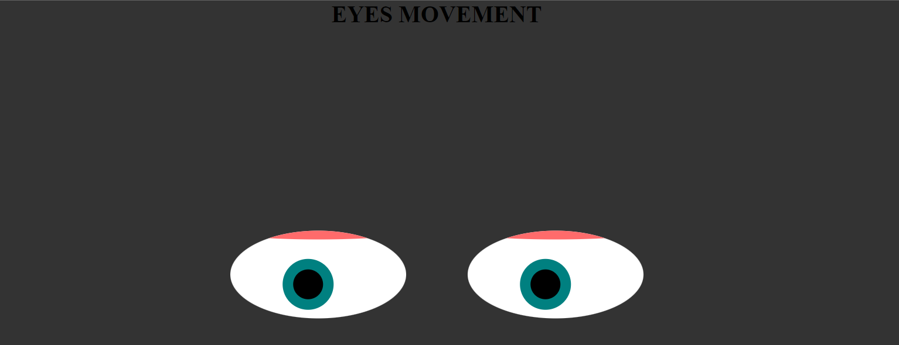

<div align="center" id="top"> 
  

&#xa0;

<a href="https://rayloria.github.io/Eyes-Exercise-MIT/">Demo</a>

</div>

<h1 align="center">Eyes Exercise</h1>

<p align="center">
  

  

  

  

  <!--  -->

  <!--  -->

  <!--  -->
</p>

<!-- Status -->

<!-- <h4 align="center">
	🚧  Eye Exercise 🚀 Under construction...  🚧
</h4>

<hr> -->

<p align="center">
  <a href="#dart-about">About</a> &#xa0; | &#xa0; 
  <a href="#sparkles-features">Features</a> &#xa0; | &#xa0;
  <a href="#rocket-technologies">Technologies</a> &#xa0; | &#xa0;
  <a href="#white_check_mark-requirements">Requirements</a> &#xa0; | &#xa0;
  <a href="#checkered_flag-starting">Starting</a> &#xa0; | &#xa0;
  <a href="#memo-license">License</a> &#xa0; | &#xa0;
  <a href="https://github.com/RayLoria" target="_blank">Ray Loria</a>
</p>

<br>

## :dart: About

This project has been created with two eyes that follow the mouse pointer as much as you move it, when you touch it the eye close, for the future version I going to add went you touch the eye both close and chance de background for a random image, add some style with css.

## :minidisc: How to run ##

No special installation required, just open the index.html file in a web browser. To edit have visual studio code installed

## :spiral_calendar: Roadmap of future improvements ##

:black_circle: Fix some bugs with the eye close.
:black_circle: Fix resposive desing and add some css style


## :sparkles: Features

✔️ PacMan images change random;
✔️ PacMan moving x and y axis;
✔️ PacMan with collision detenction;

:heavy_check_mark: Eyes movement with the pointer;\
:heavy_check_mark: Blink function eyes;\

## :rocket: Technologies

The following tools were used in this project:

- [HTML](https://www.w3schools.com/html/)
- [CSS](https://www.w3schools.com/css/)
- [JAVASCRIPT](https://www.w3schools.com/js/)

## :white_check_mark: Requirements

Before starting :checkered_flag:, you need to have [Git](https://git-scm.com) and [Visual Studio](https://code.visualstudio.com/) installed.

## :checkered_flag: Starting

```bash
# Clone this project
$ git clone https://github.com/RayLoria/Eyes-Exercise-MIT

# Access
$ cd Eyes-Exercise-MIT

# Install dependencies
$ none required

# Run the project
$ Open with live server

# The server will initialize in the <http://localhost:3000>
```

## :memo: License

This project is under license from MIT. For more details, see the [LICENSE](LICENSE.md) file.

Made with :heart: by <a href="https://github.com/RayLoria" target="_blank">Ray Loria</a>

&#xa0;

<a href="#top">Back to top</a>
